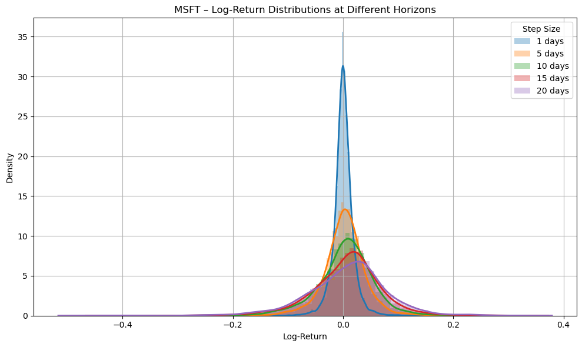

The goal of GBM.ipynb is to use the feature of GBM that is log-normal returns and use pyMC montecarlo simulation to to use this prior 

### Modeling changes in stock price $\(dS_t\)$
Short revision:
Starting with the SDE (Stochastic Differential Equation) for GBM (Geometric Brownian Motion), which is:

$dS_t = \mu S_t dt + \sigma S_t dW_t$

where:
- $S_t$ = asset price at time \(t\)
- $\mu$ = drift (expected return)
- $\sigma$ = volatility
- $dW_t$ = increment of a Wiener process (Brownian motion)

We like to see things that are **normally** distributed so we can find maximum likelihood based on it. 

In the next section we will see that in fact, if we **log-transform the $S_t$**, call it $X_t = ln(S_t)$ and take the differential, it gives the logarithm of the returns $dX_t$ and this will indeed be normally distributed. We will find the mean and variance of this normally distributed variable.  

### How to interpret "(log-)Returns"?
Returns are closing price for example at end of yesterday - closing price at end of today.
Or it can also be closing price in intervals of 5 days, 10 days, 20 days...

Let's derive the mean and variance of the normally distributed log-returns quickly: 

Let $\( X_t = \ln(S_t) \)$, then by Itô's lemma, we must take taylor's series up to second order for GBM:
Taylor's Series for a Function $f(S_t)$ (for small $dS_t$ ):

For a function $f(S_t)$, the Taylor series expansion to the second order is:

$df(S_t) \approx f'(S_t)dS_t + \frac{1}{2}f''(S_t)(dS_t)^2$

In ordinary calculus, higher-order terms like $dS_t^3$ are negligible as $dt \to 0$.

Applying to $f(S_t) = \ln S_t$:

Calculate the derivatives:
- $f'(S_t) = \frac{1}{S_t}$
- $f''(S_t) = -\frac{1}{S_t^2}$

Plug into the Taylor expansion: 

$d[\ln S_t] \approx \frac{1}{S_t} dS_t - \frac{1}{2} \frac{1}{S_t^2} (dS_t)^2$

**Ito's lemma basically tells us how many terms of the  taylor's series we must take, since for GBM, $dt^2$ is not zero, since it's nowhere differentiable**:

### Log-normal returns with mean $(\mu - \frac{1}{2}\sigma^2)t$ and variance $\sigma^2 t$
$dX_t = \frac{1}{S_t} dS_t - \frac{1}{2} \frac{1}{S_t^2} (dS_t)^2$

Plug in $dS_t$ and **consider** $d_t^2$ and $d_td_W$ are zero, and $d_W^2 = dt$: 

$dX_t = \frac{1}{S_t} (\mu S_t dt + \sigma S_t dW_t) - \frac{1}{2} \frac{1}{S_t^2} (\sigma S_t)^2 dt
= (\mu dt + \sigma dW_t) - \frac{1}{2} \sigma^2 dt
= (\mu - \frac{1}{2}\sigma^2)dt + \sigma dW_t$

This formula depends only on $\mu$ and $\sigma$ and we have eliminated $S_t$ from the SDK with multiplicative noise that we started to model the changes in stock price with, and only have them in log-form. 

Now, integrate both sides from 0 to $t$:

$X_t - X_0 = (\mu - \frac{1}{2}\sigma^2) t + \sigma W_t$

$\ln(S_t) = \ln(S_0) + (\mu - \frac{1}{2} \sigma^2)t + \sigma W_t$

Now we just want log returns **over period t** $r_t$ i.e. $\ln(S_t) - \ln(S_0)$:

$r_t = \ln \left( \frac{S_t}{S_0} \right) = \ln(S_t) - \ln(S_0) = (\mu - \frac{1}{2}\sigma^2)t + \sigma W_t$

## Distribution of Log-Returns:

Since $W_t \sim N(0, t)$, the log return is **normally distributed**:

$r_t \sim N \left( (\mu - \frac{1}{2}\sigma^2)t, \sigma^2 t \right)$

### Bayesian model using pyMC 
We have used pyMC with normal prior for $\mu$ and half normal for $\sigma$ with a wide variance which is basically a non-informative prior.

The pyMC sampler uses 95\% acceptance to sample from those priors to fit the normal distribution to the log returns with mean $(\mu - \frac{1}{2}\sigma^2)t$ and variance $\sigma^2 t$. 

### Noise-signal tradeoff for choice of dt intervals for log-returns

When we used daily returns, the noise was too much compared to the signal so the priors were not updated. 

Using dt intervals for (log-) returns gave us the following resutls for dt-intervals from 5 to 20 days, which shows the model is robust to this parameter.

